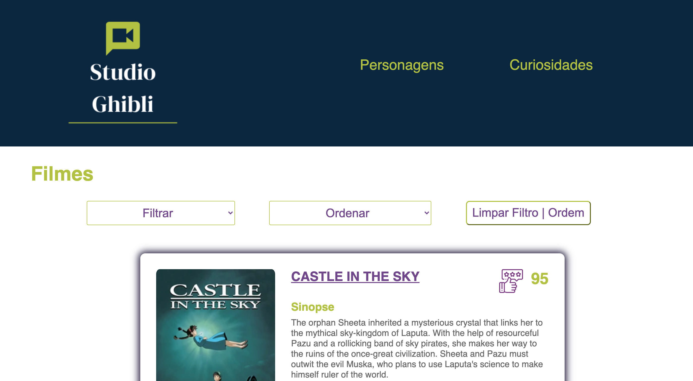
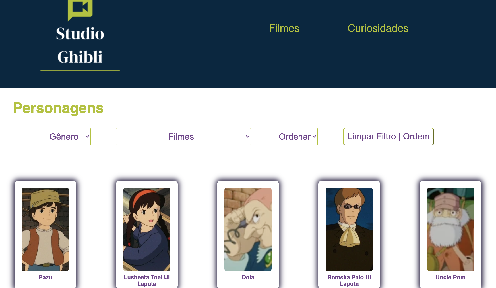
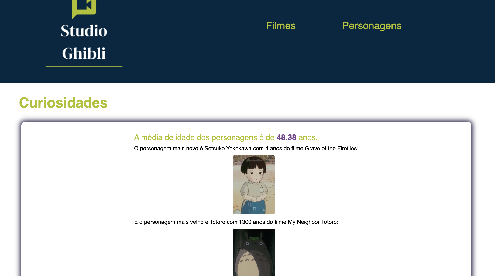
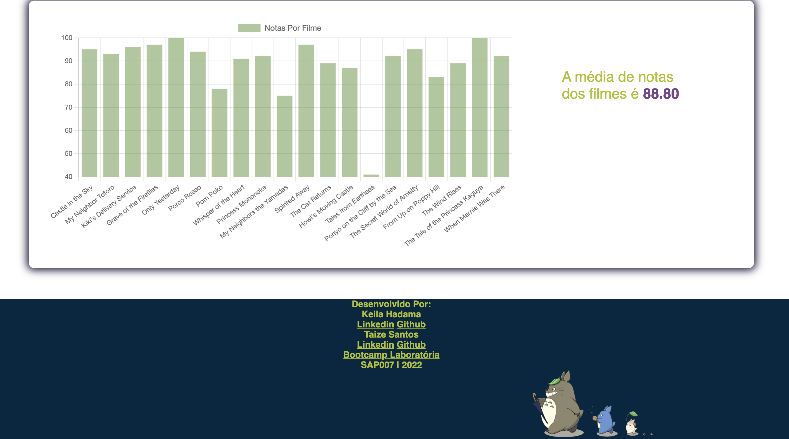
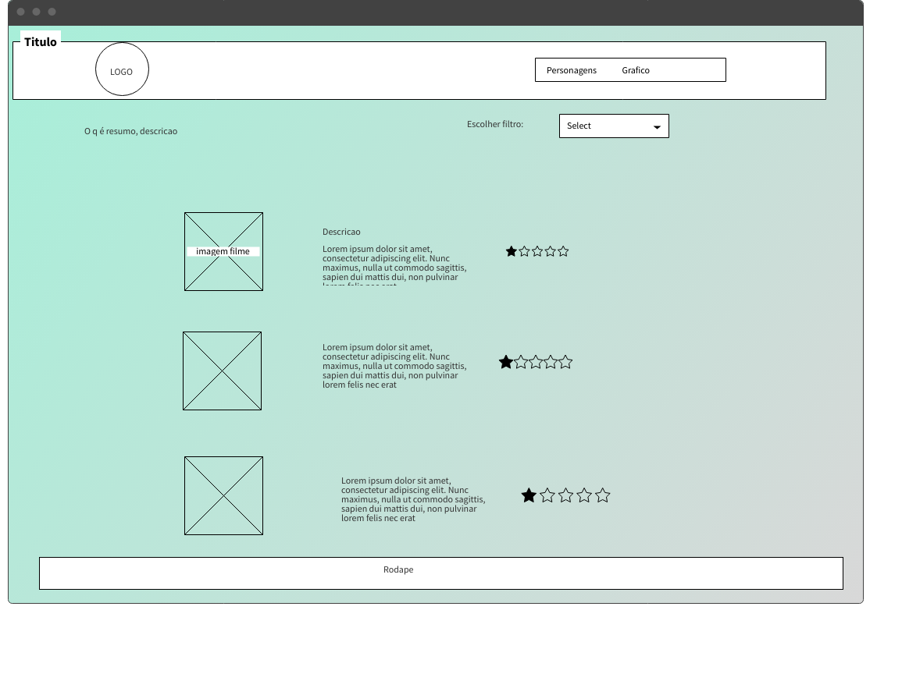
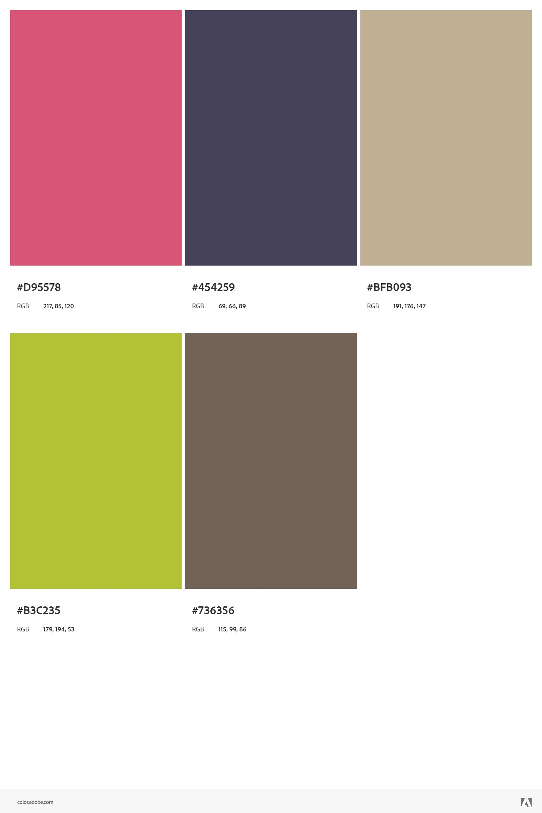

# Data Lovers

## Visite nossa página aqui: <p> <a href="https://hadamakei.github.io/SAP007-data-lovers/index.html"> Studio Ghibli-Data Lovers </a> </p>

## Índice

- [1. Proposta de projeto](#1-Proposta-de-projeto)
- [2. Projeto realizado](#2-Projeto-realizado)
- [3. Histórias de Usuários](#3-Histórias-de-Usuários)
- [4. Protótipo de baixa fidelidade](#4-Protótipo-de-baixa-fidelidade)
- [5. Protótipo de alta fidelidade](#5-Protótipo-de-alta-fidelidade)
- [6. Paleta de Cores](#6-Paleta-de-Cores)
- [7. Ferramentas e metodologia aplicada](#7-Ferramentas-e-metodologia-aplicada)
- [8. Aprendizado adquirido](#8-Aprendizado-adquirido)
- [9. Considerações técnicas](#9-Considerações-técnicas)
- [10. Desenvolvido](#10-Desenvolvido])
- [11. Como usar](#11-Como-usar)
---

## 1. Proposta de projeto
Projeto Data Lovers realizado no bootcamp da Laboratória (_SAP007_)
com a proposta de **construir uma _página web_ para visualizar um _conjunto
(set) de dados_**, tendo como objetivo principal aprender a desenhar e construir uma
interface que se adeque às necessidades do usuário.

O entregável final deve conter:

- [x] UI: Visualizar dados.
- [x] UI: Permite ordenar dados por um ou mais campos (Ex:asc e desc).
- [x] UI: Permite filtrar dados com base em uma condição.
- [x] UI: Cálculo agregado (Ex: médias, valores máximos e
      mínimos, etc).
- [x] UI: É _responsivo_.
- [x] Utilização de VanillaJS.
- [x] Passa pelo linter
- [x] Testes unitários (Jest) cobrem um mínimo de 70% de statements, functions, lines e
      branches.

## 2. Projeto realizado

A escolha do tema para o projeto foi o Studio Ghibli.

O Studio Ghibli é um estúdio de animação japonês, fundado em 1985 por Hayao Miyazaki, Isao Takahata, Toshio Suzuki e Yasuyoshi Tokuma. 
Ele conta com 20 longas-metragens, como, **Meu Amigo Totoro**, **A Viagem de Chihiro**, **O Castelo Animado**.

As animações são bem recebidas em todo o mundo e algumas já receberam nomeações e prêmios. Os longas se destacam ao provar que a animação não é só para crianças, bem como pela representatividade feminina em seus personagens.
Seus filmes tratam de diversos temas, desde aqueles que são normalmente abordados em obras direcionadas a crianças, 
como amizade, amor e família. Até temáticas que não aparecem com frequência, como amadurecimento, medo, guerra, consciência ecológica e muitos outros.

A interface proposta no site é dividido em 3 páginas:
 
- **Página de filmes** - Possibilita a visualização de todos os filmes do estúdio com detalhes sobre cada um. Os filmes podem ser filtrados por diretor e produtor e ordenados por ordem alfabética e data de lançamento.


- **Página de Personagens** - Possibilita a visualização de cards com as informações de todos os personagens que podem ser filtrados por gênero, por filme e ordenados por ordem alfabética.


- **Página de curiosidades** - Mostra um dashboard com a média de idades dos personagens e um gráfico com notas por filme e sua média de avaliação.




## 3. Histórias de Usuários

Uma História de Usuário representa em linguagem simples o que o usuário faz, precisa e o por que, de maneira concisa.
Algumas das averiguações levadas em consideração para o desenvolvimento destas histórias são:

- Studio Ghibli tem várias animações e para nossos usuários é importante saber quantas e quais são
- As mentes por trás de cada animação são os diretores e produtores, sendo que eles podem ter contribuído na criação de mais de uma obra. Portanto, é importante
para nosso usuário poder conhecê-los e saber quantas e quais são as criações em que eles trabalharam
- As animações possuem informações relevantes para nossos usuários, como descrição, data de lançamento, diretor, produtor e personagens
- Cada animação tem seus personagens e para nossos usuários é importante saber quantos e quais são
- Os personagens têm características únicas que o usuário deseja conhecer, como nome, idade, sexo, espécie, etc.

![História1] O usuário pode filtrar os filmes por nome de diretor ou nome de produtor. Pode também escolher a ordem de exibição dos filmes por ordem alfabética, data de lançamento mais antigo ou mais recente.

![História2] O usuário pode filtrar os personagens por gênero(feminino, masculino, indefinido) ou por filme em que aparece. O usuário também escolhe a ordem que os personagens aparecem na tela por ordem alfabética crescente ou decrescente.

![História3] O usuário pode visualisar as curiosidades sobre os filmes e personagens. A média de idade dos personagens, o personagem mais velho e o mais novo. Além de poder visualizar em gráfico a média das notas de avaliação dos filmes.

## 4. Protótipo de baixa fidelidade

- Pentende de inclusão

## 5. Protótipo de alta fidelidade



## 6. Paleta de Cores



## 7. Ferramentas e metodologia aplicada

Utilização do Trello para organização durante as Sprints do projeto, realizando a divisão de baby steps para as tarefas desenvolvidas, geradas a partir do Backlog.
Realização das cerimonias de metodologia ágil: Daily, Sprint Planning, Sprint Review, Sprint Retrospective, e Sprint Checkout.
<br>


## 8. Aprendizado adquirido

### HTML e CSS

- [x] [Uso de HTML semântico.](https://developer.mozilla.org/en-US/docs/Glossary/Semantics#Semantics_in_HTML)
- [x] Uso de seletores de CSS.
- [x] Construir sua aplicação respeitando o desenho realizado (protótipo).
- [x] [Uso de flexbox em CSS, bem como, borda, margem, preenchimento*.](https://css-tricks.com/snippets/css/a-guide-to-flexbox/)

### DOM e Web APIs

- [x] Uso de seletores de DOM.
- [x] Gerenciamento de eventos de DOM.
- [x] [Manipulação dinâmica de DOM.](https://developer.mozilla.org/pt-BR/docs/DOM/Referencia_do_DOM/Introdu%C3%A7%C3%A3o) (appendChild |createElement | createTextNode| innerHTML | textContent | etc.)

### JavaScript

- [x] Uso de condicionais (if-else | switch | operador ternário)
- [x] Uso de laços (for | for..in | for..of | while)
- [x] Uso de funções (parâmetros | argumentos | valor de retorno)
- [x] Manipular arrays (filter | map | sort | reduce)
- [x] Manipular objects (key | value)
- [x] Uso ES modules ([`import`](https://developer.mozilla.org/en-US/docs/Web/JavaScript/Reference/Statements/import) | [`export`](https://developer.mozilla.org/en-US/docs/Web/JavaScript/Reference/Statements/export))
- [x] Diferenciar entre expression e statements.
- [x] Diferenciar entre tipos de dados atômicos e estruturados.

### Testing

- [x] [Teste unitário.](https://jestjs.io/docs/pt-BR/getting-started)


### Estrutura do código e guia de estilo

- [x] Organizar e dividir o código em módulos (Modularização)
- [x] Uso de identificadores descritivos (Nomenclatura | Semântica)
- [x] Uso de linter (ESLINT)

### Git e GitHub

- [x] Uso de comandos de git (add | commit | pull | status | push)
- [x] Gerenciar repositórios de GitHub (clone | fork | gh-pages)
- [x] Colaboração no Github (branches | pull requests | |tags)

### Bibliotecas

- [x] bibliotecas de gráficos [Chart.js](https://www.chartjs.org/)

## 9. Considerações técnicas

O _boilerplate_ contém a seguinte estrutura de arquivos:

```text
.
├── EXTRA.md
├── README.md
├── package.json
├── src
|  ├── data 
|  |  └── ghibli
|  |  |  ├── ghibli.js
|  ├── data.js
|  ├── index.html
|  ├── main.js
|  └── style.css
└── test
   └── data.spec.js


```

## 10. Desenvolvido Por

[Keila Hadama]


<a href="https://github.com/hadamakei" target="_blank"></a>
<a href="https://www.linkedin.com/in/keila-hadama-45a903193/" target="_bank"></a>

[Taize Santos]


<a href="https://github.com/taizesantos" target="_blank"></a>
<a href="https://www.linkedin.com/in/taizeborges/" target="_bank"></a>


## 11. Como usar
Você precisará usar o Node.js

Clonar o projeto

` $ git clone https://github.com/taizesantos/SAP007-data-lovers`

Instalar as dependências do projeto

` $ npm install or yarn`

Iniciar a aplicação

` $ npm start or yarn start`

Realizar os testes unitários

` $ npm test or yarn test`
